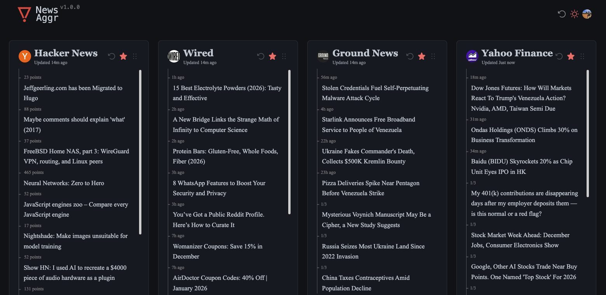

# NewsAggr 📰

> **Elegant News Aggregator** 🚀



## About 🧠

I built **NewsAggr** out of a simple personal need: a unified, distraction-free hub to keep up with the daily news.

This project is heavily based on [ourongxing/newsnow](https://github.com/ourongxing/newsnow). I used it as a starting point and modified the styles to fit my personal taste and added the specific data sources I was interested in.

## Features ✨

*   **Clean & Elegant UI** 🎨 - Designed for focus and readability.
*   **Real-time Updates** ⚡ - News delivered instantly.
*   **Smart Caching** 🤖 - Default 30-minute cache, with adaptive scraping intervals (min 2 mins) to respect source limits.
*   **OAuth Integration** 🔒 - Log in seamlessly with **Google** or **GitHub** to sync your preferences.
*   **Responsive Design** 📱 - Works on all devices and can be installed as a PWA.
*   **Dark Mode** 🌙 - Support for dark mode.
*   **Bookmarks** 🔖 - Save articles to read later.

## Live Version 🌐

Want to see it in action? You can find the production version here: [newsaggr.online](https://newsaggr.online/)

## Data Sources 📡

| Source | Category | Link |
| :--- | :--- | :--- |
| Arxiv AI | AI | [Link](https://arxiv.org/list/cs.AI/recent) |
| smol.ai | AI | [Link](https://news.smol.ai/) |
| TechCrunch (AI) | AI | [Link](https://techcrunch.com/category/artificial-intelligence/) |
| Forbes | Entrepreneurship | [Link](https://www.forbes.com/) |
| YC Blog | Entrepreneurship | [Link](https://www.ycombinator.com/blog) |
| Wall Street Journal | Finance | [Link](https://www.wsj.com/) |
| Yahoo Finance | Finance | [Link](https://finance.yahoo.com/) |
| Crónica Balear | Mallorca | [Link](https://www.cronicabalear.es/noticias/baleares/) |
| Diario Mallorca | Mallorca | [Link](https://www.diariodemallorca.es/local/) |
| Ultima Hora | Mallorca | [Link](https://www.ultimahora.es/noticias.html) |
| Nature | Science | [Link](https://www.nature.com/news) |
| ScienceDaily | Science | [Link](https://www.sciencedaily.com/) |
| El Diario | Spain | [Link](https://www.eldiario.es/politica/) |
| El Mundo | Spain | [Link](https://www.elmundo.es/espana.html) |
| El País | Spain | [Link](https://elpais.com/espana/) |
| Engadget | Tech | [Link](https://www.engadget.com/) |
| Github | Tech | [Link](https://github.com/) |
| Hacker News | Tech | [Link](https://news.ycombinator.com/) |
| TechCrunch | Tech | [Link](https://techcrunch.com/) |
| TLDR | Tech | [Link](https://tldr.tech/) |
| Wired | Tech | [Link](https://www.wired.com/) |
| BBC | World | [Link](https://www.bbc.com/) |
| CNN | World | [Link](https://edition.cnn.com/) |
| Ground News | World | [Link](https://ground.news/daily-briefing) |
| NY Times | World | [Link](https://www.nytimes.com/) |

## Quick Start (Local) 🛠️

Want to run this locally? Easy. You just need **Node.js >= 20** and **pnpm**.

```bash
# 1. Install dependencies
pnpm i

# 2. Start the dev server
pnpm dev
# 🚀 Running at http://localhost:5173
```

## Deployment (Production) 🚀

The recommended way to deploy is **Cloudflare Pages** with a **D1 Database**. It's fast, cheap (often free), and scales infinitely.

### 1. Cloudflare Pages + D1 Setup 🌩️

1.  **Fork** this repo.
2.  Create a **D1 Database** in your Cloudflare dashboard.
3.  Update `wrangler.toml` (or rename `example.wrangler.toml`) with your DB details:
    ```toml
    [[d1_databases]]
    binding = "NEWSAGGR_DB"
    database_name = "your-db-name"
    database_id = "your-db-id"
    ```

### 2. Configure Environment Variables 🔐

For production, you'll need to set these variables in your Cloudflare Pages project settings:

*   `GITHUB_CLIENT_ID` & `GITHUB_CLIENT_SECRET`: For GitHub login.
*   `GOOGLE_CLIENT_ID` & `GOOGLE_CLIENT_SECRET`: For Google login.
*   `JWT_SECRET`: Random string for signing tokens.
*   `INIT_TABLE`: Set to `true` for the first deploy to create tables.
*   `ENABLE_CACHE`: `true` (recommended).

### 3. Automatic Deploys with GitHub Actions 🤖

To enable auto-deploys on every commit, you need to add these **Secrets** to your GitHub Repository settings:

*   `CLOUDFLARE_API_TOKEN`: Your Cloudflare API Token.
*   `CLOUDFLARE_ACCOUNT_ID`: Your Cloudflare Account ID.

Once set, the included `.github/workflows/test-and-deploy.yml` will handle the rest!

## Adding Data Sources 🔌

> Check out [CONTRIBUTING.md](CONTRIBUTING.md) for a deep dive on adding sources.

## Roadmap 🗺️

*   [ ] More data sources 📡
*   [ ] AI-powered summaries 🧠 (Maybe?)

## Contributing 🤝

Got a cool idea? Found a bug? Open a PR! We love contributions.
See [CONTRIBUTING.md](CONTRIBUTING.md) for guidelines.

## License 📄

[MIT](./LICENSE) © bertini36
